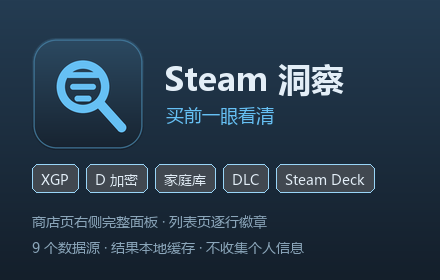

# Steam 洞察 · Steam Insight

在 Steam 商店页和列表页上，一眼看清一款游戏值不值得买。

一个 Chrome / Edge（Manifest V3）浏览器扩展，在**游戏详情页**右侧显示完整信息面板，在**愿望单 / 搜索 / 特卖 / 标签页**为每款游戏显示一排徽章。



## 功能

**核心四项**

| 功能 | 说明 | 数据来源 |
| --- | --- | --- |
| 家庭库 | 是否支持家庭共享，以及是否已在你的 Steam 家庭组共享库中（区分"他人拥有 / 被排除 / 我自己有"） | Steam 官方 `appdetails`（category 62）+ `IFamilyGroupsService` |
| DLC 情况 | DLC 总数、每个 DLC 的名称与价格 | Steam 官方 `appdetails` |
| 是否 Xbox Game Pass | 对照微软官方 PC Game Pass 全量库（约 556 款） | 微软官方 SIGL + 展示目录接口 |
| 是否 D 加密（Denuvo） | 读取商店页的第三方 DRM 声明 | Steam 商店页 `.DRM_notice` |

**附加功能**

- **Steam Deck 兼容性**（官方"已验证 / 可玩 / 不支持"）+ **ProtonDB** 兼容评级
- **反作弊检测**：EAC / BattlEye 等，并标出可能加载内核驱动的内核级反作弊
- **第三方启动器**（Ubisoft Connect、EA app、Rockstar 等）与第三方协议提示
- **中文支持**：界面/字幕 与 完整语音 分别显示
- **国区是否可购买**
- **多区价格对比**：国区 / 美区 / 阿根廷 / 土耳其 / 俄区 / 印度 / 巴西（区域可自选）
- **通关时长**（HowLongToBeat）：主线 / 主线+支线 / 全收集
- **一键复制为 Markdown / 导出 JSON**

## 安装

商店上架审核中。当前可以按开发者方式加载：

1. 打开 `chrome://extensions`（Edge 为 `edge://extensions`）
2. 打开右上角 **开发者模式**
3. 点 **加载已解压的扩展程序**，选择本仓库的 `steam-insight` 目录
4. 打开任意 Steam 游戏页，右侧信息栏顶部会出现面板

装完建议先打开扩展设置页点一次 **检查数据源可用性**。

## 数据来源

| 数据 | 来源 | 缓存 |
| --- | --- | --- |
| 游戏基础信息 / DLC / 语言 / 价格 | `store.steampowered.com/api/appdetails` | 12 小时 |
| 支持家庭共享 | 同上，`categories` 含 id 62 | 12 小时 |
| Steam Deck 兼容性 | `store.steampowered.com/saleaction/ajaxgetdeckappcompatibilityreport` | 7 天 |
| D 加密 / 第三方 DRM | Steam 商店页 HTML 的 `.DRM_notice` | 24 小时 |
| Xbox Game Pass | `catalog.gamepass.com` + `displaycatalog.mp.microsoft.com` | 12 小时 |
| 反作弊 | [AreWeAntiCheatYet](https://github.com/AreWeAntiCheatYet/AreWeAntiCheatYet) 的 `games.json` | 24 小时 |
| ProtonDB | `www.protondb.com/api/v1/reports/summaries/{appid}.json` | 24 小时 |
| 通关时长 | `howlongtobeat.com/api/search/site` | 7 天 |
| 我的家庭组 | `pointssummary/ajaxgetasyncconfig` → `IFamilyGroupsService` | 15 分钟 |

所有请求都在扩展的 Service Worker 里发出；Steam 之外的调用只发送游戏标识（AppID 或游戏名）。

## 工作原理

内容脚本只做两件事：读当前页面 DOM、渲染结果。所有网络请求、缓存与数据聚合都在 Service Worker 中完成，通过消息通信。这样做的原因是：Steam 接口与 ProtonDB / HowLongToBeat 都不返回 CORS 头，必须在后台发起。

```
steam-insight/
├── manifest.json
├── icons/
└── src/
    ├── background.js        Service Worker：网络请求、缓存、聚合
    ├── lib/
    │   ├── constants.js     区域、反作弊白名单、TTL、默认设置
    │   ├── net.js           带超时/重试的 fetch、并发限制
    │   ├── cache.js         chrome.storage.local 上的 TTL 缓存
    │   ├── steam.js         Steam 接口 URL 构造 + 纯解析（含商店页 DRM 解析）
    │   ├── sources.js       XGP / AreWeAntiCheatYet / ProtonDB / HLTB 解析
    │   └── format.js        Markdown / JSON 导出
    ├── content/             读 DOM + 渲染
    ├── options.html/js      设置页
    └── popup.html/js        工具栏弹窗
```

`src/lib/*.js` 全部是不依赖浏览器 API 的纯函数，可以直接在 Node 下测试。

## 隐私

不收集任何个人信息：没有账号、没有统计、没有遥测、没有广告、没有推广链接，也不会修改 Steam 的价格或购买链接。

只有在你开启"我的家庭组"功能并已登录 Steam 时，扩展才会用你浏览器里已有的登录凭据调用 Steam 自己的接口读取家庭共享库；结果只缓存在本地 15 分钟，不会发往任何第三方。

完整说明见 [store/PRIVACY.md](store/PRIVACY.md)。

## 已知限制

1. **D 加密只反映 Steam 商店页上的第三方 DRM 声明**。若该页被年龄验证拦截，面板会明确显示"需要先通过年龄验证"，而不是当作没有 D 加密。
2. **XGP 是名称匹配**。微软官方数据里没有 Steam AppID，扩展用归一化后的英文标题做精确匹配，退化时标"疑似"。同名重制版可能误判。
3. **家庭组依赖非公开接口**，未登录时只显示"支持家庭共享"标记。
4. **HowLongToBeat 有反爬**，token 绑定 IP + UA，且 CDN 会限流；失败时该行不显示，10 分钟后重试。
5. **"内核级反作弊"是按名称白名单推断的**，AreWeAntiCheatYet 本身没有这个字段。
6. **多区价格**只反映 Steam 在所选区域的标价，不含锁区、支付方式与税费差异；阿根廷和土耳其自 2023 年 11 月起改为美元计价。

## 构建

```bash
# 生成图标与商店素材（需要 Pillow）
python build/make_icons.py

# 打包成商店提交用的 ZIP，并做结构自检
python build/build_packages.py

# 校验商店文案有没有超出字数限制
python build/check_listing_lengths.py
```

## 测试

```bash
cd steam-insight-dev

# 1) 抓回测试数据（不入库）
node fetch_fixtures.mjs

# 2) 纯解析回归测试
node selftest.mjs

# 3) 额外的真实网络端到端测试（走代理时先设环境变量）
#    $env:NODE_USE_ENV_PROXY=1; $env:HTTPS_PROXY='http://127.0.0.1:7897'
node selftest.mjs --live
```

测试用真实抓取的数据做断言（真实 Steam 商店页、真实接口响应），不是构造的假数据。离线部分 84 项，联网端到端 94 项。

## 许可证

[GPL-3.0](LICENSE)

## 免责声明

本项目是非官方的第三方工具，与 Valve、微软、ProtonDB、HowLongToBeat、AreWeAntiCheatYet 均无关联，未获得其背书或授权。所有商标归各自所有者所有。

## 致谢

- [AreWeAntiCheatYet](https://github.com/AreWeAntiCheatYet/AreWeAntiCheatYet) —— 反作弊数据库
- [ProtonDB](https://www.protondb.com/) —— Linux / Proton 兼容评级
- [HowLongToBeat](https://howlongtobeat.com/) —— 通关时长
- [Augmented Steam](https://github.com/IsThereAnyDeal/AugmentedSteam) 与 [xPaw 的 Steam Web API 文档](https://steamapi.xpaw.me/) —— Steam 非公开接口的整理
